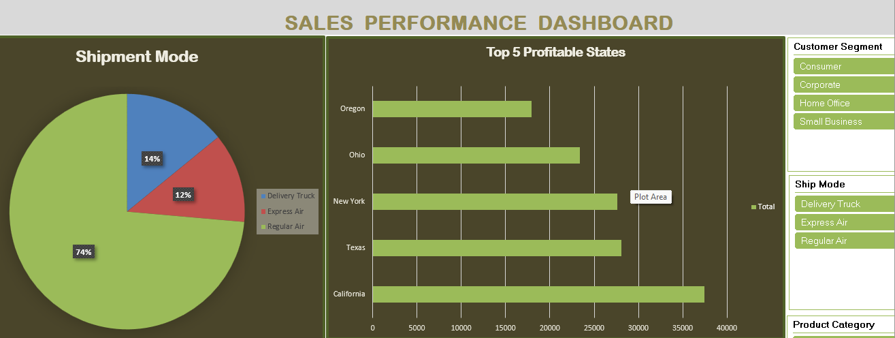
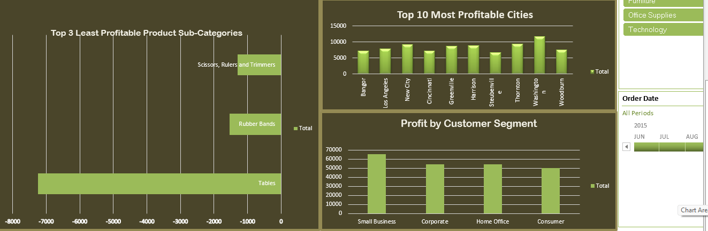

# 📊 Interactive Excel Sales Dashboard

## 📌 Project Overview

This project presents an interactive **Sales Dashboard** developed using **Microsoft Excel**. The dashboard provides business insights through KPI cards, Pivot Tables, Pivot Charts, and Slicers, helping users analyze sales performance and make informed business decisions.

---

## 🎯 Project Objectives

- Analyze sales performance.
- Monitor KPIs.
- Compare sales by category and region.
- Track sales trends.
- Create an interactive reporting dashboard.

---

## ✨ Dashboard Features

- 📊 KPI Cards
- 📈 Sales Trend Analysis
- 📍 Region-wise Sales
- 🛍️ Category-wise Sales
- 🎛️ Interactive Slicers
- 📋 Pivot Tables
- 📉 Pivot Charts
- 📊 Dynamic Dashboard

---

## 🛠️ Tools Used

- Microsoft Excel
- Advanced Excel
- Pivot Tables
- Pivot Charts
- Slicers
- Conditional Formatting
- Data Visualization

---

## 📸 Dashboard Preview

The following screenshots showcase the interactive Excel Sales Dashboard.

### Dashboard Overview

---

### Interactive Sales Analysis

---

## 📈 Key Insights

- Sales performance monitoring
- KPI reporting
- Interactive filtering using slicers
- Category-wise and region-wise analysis
- Business reporting using Pivot Tables and Pivot Charts

---

## 🚀 How to Use

1. Download the Excel workbook.
2. Open it using Microsoft Excel.
3. Navigate to the **Dashboard** worksheet.
4. Use the slicers to filter the data.
5. Analyze the KPIs and charts.

---

## 👨‍💻 Author

**Nikhil Kumar G**

🎓 MCA Graduate

💼 Aspiring Data Analyst

🔗 LinkedIn: https://www.linkedin.com/in/nikhil-kumar-g-20b2922a4

💻 GitHub: https://github.com/Nikhilkumar235

---

## ⭐ Support

If you found this project useful, consider giving this repository a ⭐ on GitHub.

---

## 📄 License

This project was developed for educational and learning purposes.
